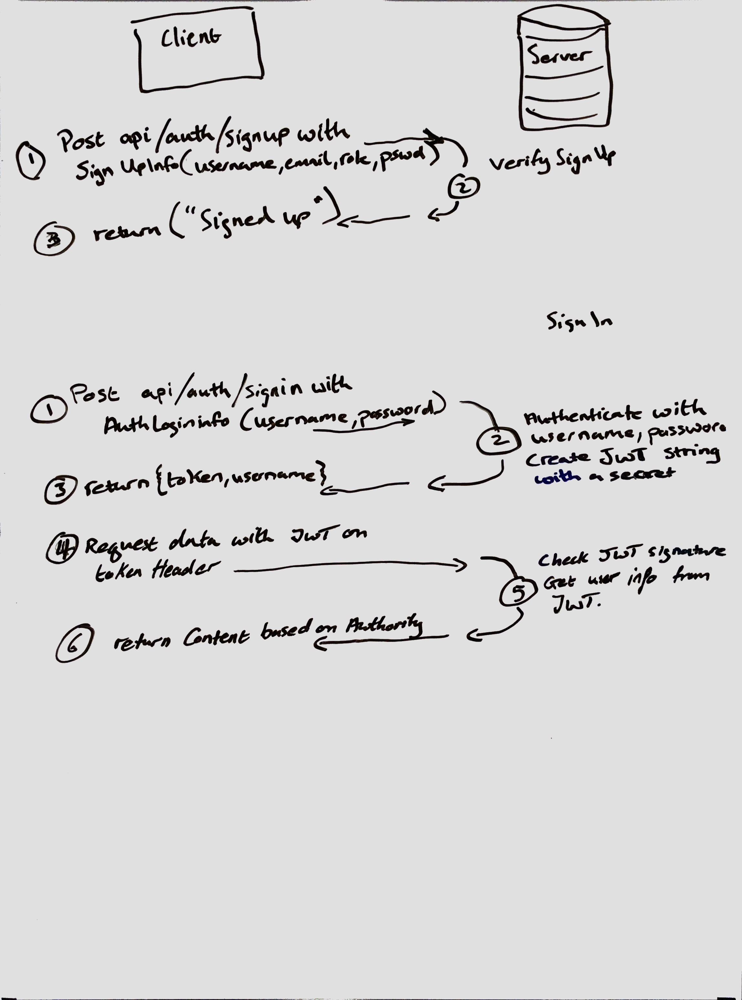

# Authentication

# Authors: Alistair Blake, Matthew Heyert
# LAB: Authentication

Fixed and documented a (broken) Basic Authentication server, with signup and signin capabilities, using a Mongo database for storage.


### Assignment: Auth Server
* Created a UML diagram of the authentication system on a whiteboard
* Identifed and fix any bugs
* **NEW CODE:** Protected the `/book` and `/book/:id` routes by requiring user authentication
* Documented and published the code with JSDoc

### Testing
* POST to /signup to create a new user
* POST to /signin to login as a user (use basic auth)
* Tests for auth middleware and the routes
  * Sends it a basic header
  * Routes assert the requirements (signup/signin)
  * The book routes are protected

### Notes

Signup with httpie: 
```
echo '{"username":"name","password":"pass"}' | http post :3000/signup
```
Signin with httpie: 
```
http post :3000/signin -a username:password
```

### UML



